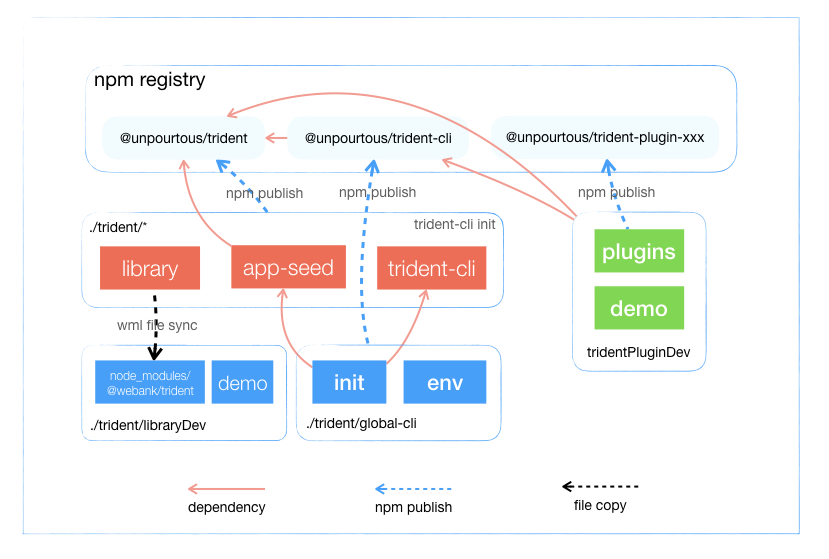

# CONTRIBUTING
本文档适用于希望参与WeTrident库开发和维护的开发者，非常期待你的参与。

## 1. 下载项目代码库
``` shell
git clone git@github.com:WeBankFinTech/WeTrident.git

cd WeTrident
```

PS: 本文档后续所有相对路径均以 `./WeTrident` 为根路径。

## 2. 认识项目结构

如下是WeTrident的关键目录: 

```
.
├── __tests__         # 测试用例目录
├── app-seed          # 项目模板，包含tab、blank等不同的模板
├── docs              # 项目文档
├── library           # WeTrident的核心模块，状态管理、导航、网络等
├── libraryDev        # WeTrident开发过程中使用的工程，这是一个完整的WeTrident工程，兼具Demo的作用
├── local-cli         # 跟随项目的 cli 工具，例如gen module/scene之类非全局命令
├── package.json      # @webank/trident是以该目录作为根目录发布npm的
├── traversal-server  # 页面自动化遍历对应的server
├── trident-cli       # 全局的cli工具，主要包含环境检查和项目初始化命令
├── trident-ui        # WeTrident配套的UI库
└── website           # 官网目录
```

上面大概列举了各个关键目录的作用，下图说明了整个库里面各个子项目之间的关系。


WeTrident对应的npm库有两个： 
- @webank/trident：WeTrident核心库
- @webank/trident-cli：WeTrident 全局cli工具

## 1. 依赖安装
WeTrident倡导统一环境直接避免异构环境导致的时间浪费，所以建议初期全都使用统一的环境。

WeTrident的开发过程中需要如下几个工具: 

| 名称 | 用途 | 
| --- | --- |
| wml | 用于开发过程中的文件同步，实时同步library目录的修改到libraryDev/node_modules下的对应目录。 [安装指引](https://github.com/wix/wml) | 
| verdaccio | 用于发布前本地模拟发布npm来做发布前的测试。 [安装指引](https://github.com/verdaccio/verdaccio) | 
| nvm | 用于node版本的管理, WeTrident项目内统一使用nvm做node版本管理。 [安装指引](https://github.com/nvm-sh/nvm) | 

上述几个基础工具安装完成以后安装WeTrident需要的node版本
```
nvm install
```

## 2. 启动 libraryDev
如果没有安装`trident-cli`请先安装: 
```
npm i -g @webank/trident-cli


cd libraryDev

# 初始化安装依赖
tdt install

# 通过iOS模拟器启动libraryDev
tdt run ios

# 先启动Android模拟器再运行如下命令启动Android的libraryDev
tdt run android
```
到这里，你已经启动了最新版的WeTrident Demo。

## 3. 修改库文件
上面一步只是启动Demo，这时候 libraryDev 引用到的trident版本仍然是外网已经发布的版本。
如果希望让libraryDev引用本地的版本，只需要执行: 
```
npm run syncLib
```
这条命令负责把library和trident-ui两个目录拷贝到 libraryDev/node_modules/@webank/trident/library和libraryDev/node_modules/@webank/trident/trident-ui。
运行成果以后命令行保持打开即可保持实时同步。 接下来修改library内的内容，则可以直接体现到demo上。

### 新增依赖
在library开发过程中，可能会需要引入新的库，因为我们基于libraryDev做开发，所以，首先我们需要在libraryDev/package.json内新增依赖说明。
但是这还不够，因为对外发布以后，trident-cli 生成相关目是基于 app-seed 的，而 app-seed 依赖了@webank/trident，所以为了让这个依赖在使用WeTrident的开发者项目里面生效，需要将此依赖加到 './package.json'

## 4. 本地模拟发布
在正式发布前我们可以通过 verdaccio 模拟发布，以进行更接近真实使用环境的测试。

a. 首先启动 verdaccio
```
verdaccio
```

b. 修改 ~/.npmrc 中的 registry 为 `http://localhost:4873/`

c. 成功启动 verdaccio 以后运行下面命令发布到 verdaccio
```
npm run publishAll
```
该命令会发布 @webank/trident-cli和@webank/trident两个包，切发布前会删除 verdaccio 中的其他版本。

## 5. 测试验证

本地模拟发布完成以后，必须完成如下测试（目前只支持了核心命令和模块的测试，新增功能需要自行编写测试用例验证）才可以提交PR。
```
npm run e2e
```
根据指引进行测试验证，验证通过可以提交PR。

## 6. CLI工具开发
### trident-cli
为了方便用户使用，专门开发了 @unpourtous/trident-cli 这个npm包，后面称为`trident-cli`，主要用于承载初始化工具以及和local-cli桥接。因为考虑到 trident-cli 会以npm全局模块的方式安装到用户开发环境，更新相比起来比较困难， trident-cli中内容要尽可能少，只提供最必须带命令。可以理解为项目创建前需要的工具纳入到`glocal-cli`中，项目创建后要用到带工具命令放入到 local-cli 中，local-cli 中可以放其版本对应的特有命令，trident-cli 必须放版本无关的命令。

#### 调试本地命令
cli 在开发过程中需要进行调试，所以，必然会有需要用本地的 trident-cli 调用本地的local-cli的情况，现在的脚本中已经支持了这种方式。需要调试cli脚本，只需要运行如下
```
export useLocal=true && ./trident-cli/index.js init testProj
```

## 7. 业务插件开发
业务模块插件的开发是Trident的一大特色，开发者可以将自己某个独立可公用带业务模块以`trident-plugin`的形式输出。其他用户只需要通过 trident-cli 安装此业务插件即可使用这个公用带业务能力，常见带业务插件有 trident-plugin-feedback，trient-plugin-in-app-browser，trident-plugin-version-manager等。

### 插件初始化

如果您希望开发一个插件给别人使用，需要在项目根目录下运行

```
$ tdt plugin init [moduleName]
```

`moduleName`即为需要发布为插件的模块，此命令将在模块目录下初始化`package.json`，并自动添加`README.md`，开发者可以在 README.md 中补充插件说明。

### 插件发布

插件开发完成需要发布，在项目根目录下运行

```
$ tdt plugin publish [moduleName]
```

`moduleName`即为需要发布为插件的模块，此命令将抽取插件依赖更新至`package.json`，引导开发者更新插件版本号，执行插件发布。

### 插件安装

```
$ tdt plugin add [pluginName]
```

## 8. 开发常用工具
```shell
# iOS模拟scheme拉起
xcrun simctl openurl booted trident-scheme:///example/DemoScene?title=TestSchemeJump
```

```shell
# Android模拟scheme拉起
adb shell am start -W -a android.intent.action.VIEW -d "trident-scheme:///example/DemoScene?title=TestSchemeJump" org.reactnative.example
```

## 9. 文档发布说明
```shell
# 1. pack website
cd website
npm run pack-website

# 打包完成以后website的压缩包为./website/release/website.tgz
2. 发布到服务器 `/usr/share/nginx/html`，在服务器上运行如下命令上传文件，并解压到trident目录

rz
tar xzvf website.tgz -C trident

```

